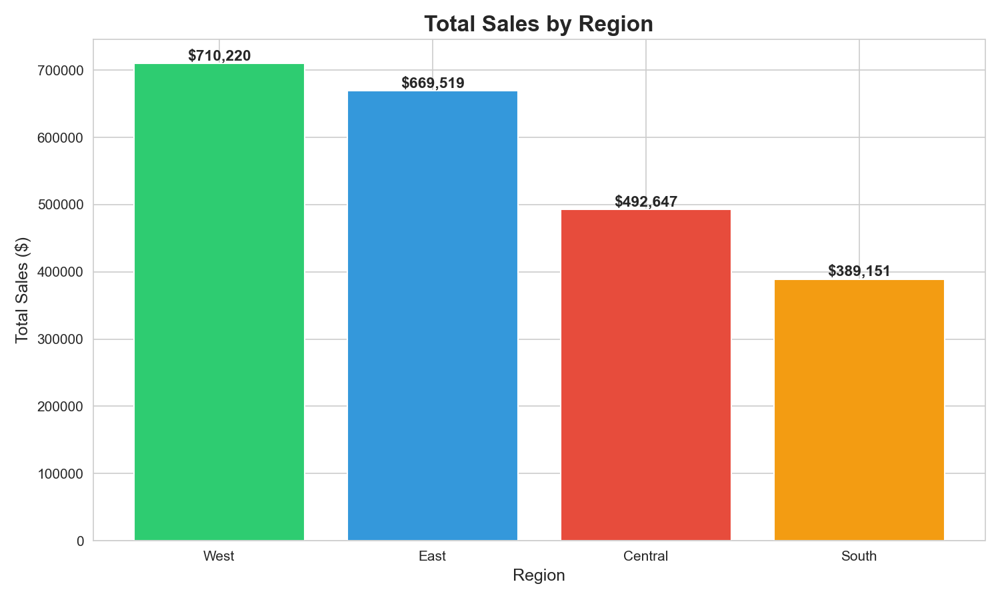
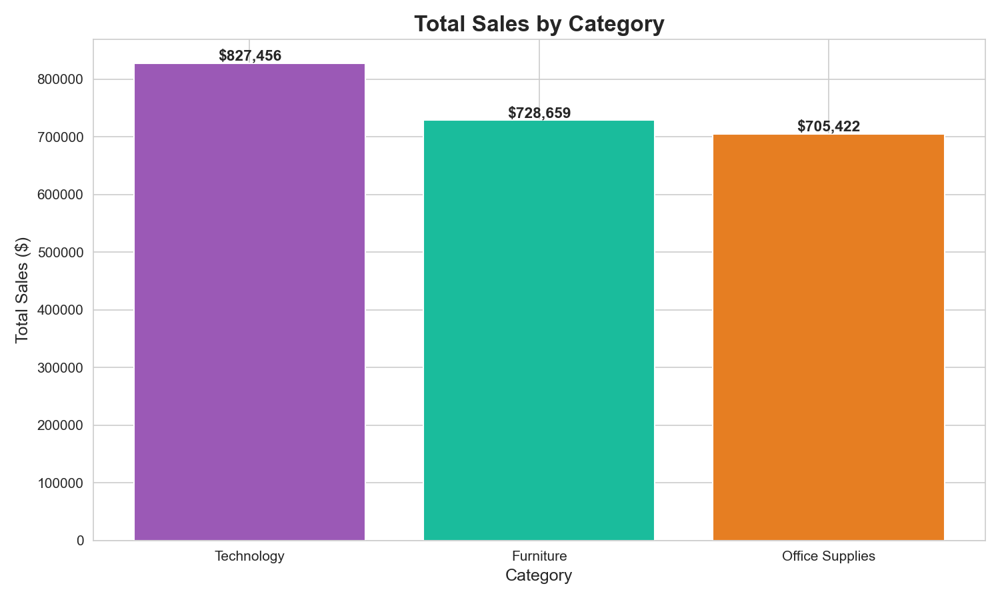
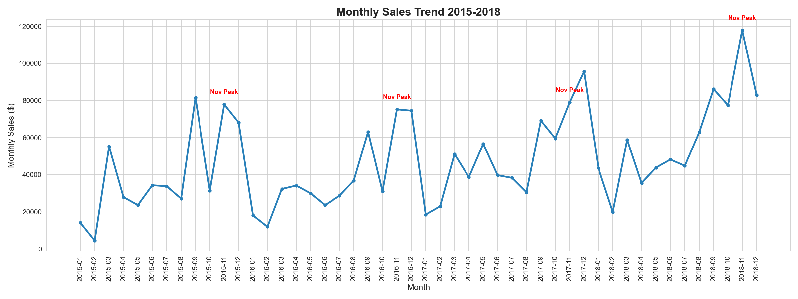
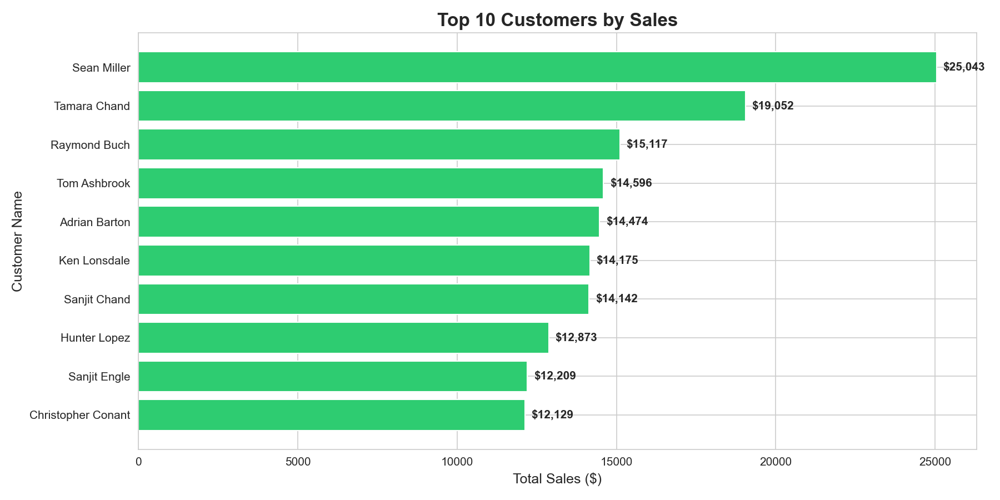

# Superstore Sales Analysis

## Project Overview
Analyzed 9,800+ retail orders from a US Superstore (2015-2018) 
to identify sales trends, top performing regions, categories, 
and customers using SQL, Python, and data visualization.

## Tools Used
- Python (Pandas, Matplotlib, Seaborn)
- SQLite3
- VS Code

## Business Questions Answered
1. Which region generates highest sales?
2. Which product category performs best?
3. What are the monthly sales trends?
4. Who are the top 10 customers by revenue?
5. Which sub-categories drive most value?

## Key Findings
- West region leads with $710,220 in total sales
- Technology is top category with $827,456 in revenue
- November consistently peaks every year (seasonality)
- Sean Miller is top customer with $25,043 across 15 orders
- Copiers have highest average order value at $2,215 per order

## Visualizations

